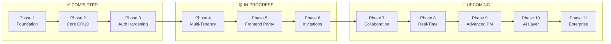
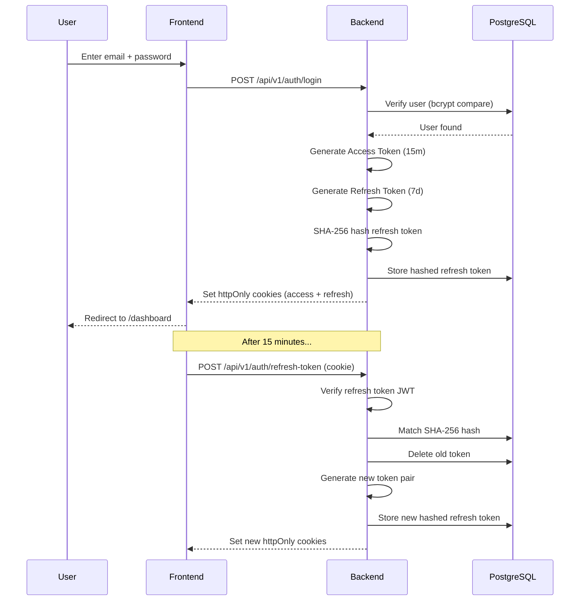
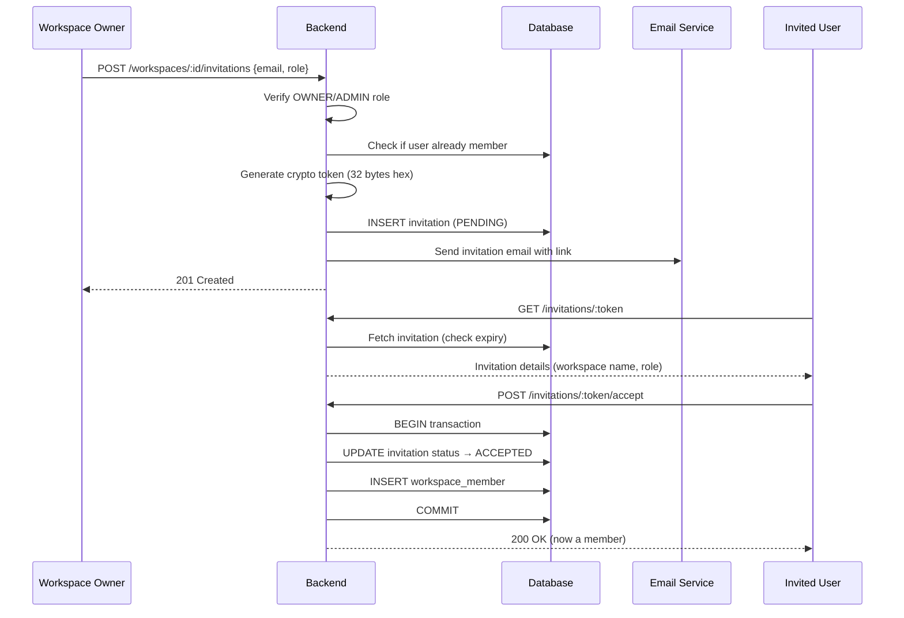
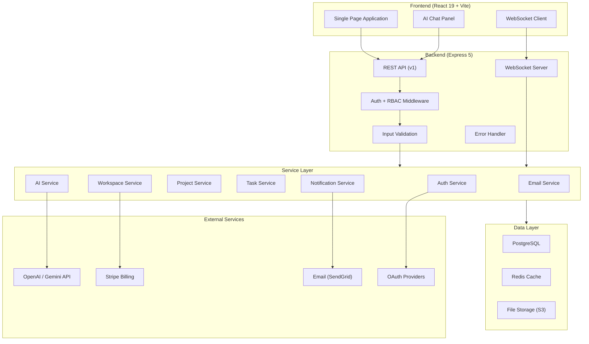

# 🗺️ ProjectForge — Production Roadmap

### AI-Powered Team & Project Management SaaS Platform
**Last Updated**: July 28, 2026 · **Total Phases**: 11 · **Current Phase**: 5

---

## 📊 Executive Progress Dashboard

```
Phase 01 ██████████████████████████████ 100%  Foundation & Scaffolding
Phase 02 ██████████████████████████████ 100%  Core CRUD & Data Layer
Phase 03 ██████████████████████████████ 100%  Auth Hardening & Security
Phase 04 ██████████████████████░░░░░░░░  75%  Multi-Tenancy & RBAC
Phase 05 █████████░░░░░░░░░░░░░░░░░░░░  30%  Frontend Parity
Phase 06 █░░░░░░░░░░░░░░░░░░░░░░░░░░░░   5%  Invitations & Onboarding
Phase 07 ░░░░░░░░░░░░░░░░░░░░░░░░░░░░░   0%  Collaboration Layer
Phase 08 ░░░░░░░░░░░░░░░░░░░░░░░░░░░░░   0%  Real-Time & Notifications
Phase 09 ░░░░░░░░░░░░░░░░░░░░░░░░░░░░░   0%  Advanced Project Management
Phase 10 ░░░░░░░░░░░░░░░░░░░░░░░░░░░░░   0%  AI Intelligence Layer
Phase 11 ░░░░░░░░░░░░░░░░░░░░░░░░░░░░░   0%  Enterprise & Scale
```

| Metric | Value |
|---|---|
| Total Backend Endpoints | 25 (documented) / 22 (implemented) |
| Total Database Tables | 7 (defined) / 6 (active) |
| Total Frontend Pages | 4 (Login, Register, Dashboard, 404) |
| Total Git Commits | 40 |
| Test Coverage | 0% |
| Frontend-Backend Feature Parity | ~40% |

---

## 🏛️ Full Roadmap Architecture



---
---

# ✅ Phase 1 — Foundation & Scaffolding `100% COMPLETE`

> **Goal**: Set up the project structure, tooling, and basic connectivity.

### What Was Built

| Item | File/Area | Status |
|---|---|---|
| React + Vite frontend scaffolding | `frontend/` | ✅ Done |
| Express 5 backend scaffolding | `backend/` | ✅ Done |
| PostgreSQL connection pool | [db.js](file:///c:/Users/Rohan/Desktop/ProjectForge%20-%20Copy/backend/src/config/db.js) | ✅ Done |
| Environment configuration | [.env](file:///c:/Users/Rohan/Desktop/ProjectForge%20-%20Copy/backend/.env) | ✅ Done |
| CORS setup (localhost:5173) | [app.js](file:///c:/Users/Rohan/Desktop/ProjectForge%20-%20Copy/backend/src/app.js) | ✅ Done |
| Express middleware (JSON, cookies) | [app.js](file:///c:/Users/Rohan/Desktop/ProjectForge%20-%20Copy/backend/src/app.js) | ✅ Done |
| API v1 router mount | [routes/index.js](file:///c:/Users/Rohan/Desktop/ProjectForge%20-%20Copy/backend/src/routes/index.js) | ✅ Done |
| Health check endpoint | [healthController.js](file:///c:/Users/Rohan/Desktop/ProjectForge%20-%20Copy/backend/src/controllers/healthController.js) | ✅ Done |
| Users table schema | [schema.sql](file:///c:/Users/Rohan/Desktop/ProjectForge%20-%20Copy/database/schema.sql) | ✅ Done |
| Project documentation (6 docs) | [docx/](file:///c:/Users/Rohan/Desktop/ProjectForge%20-%20Copy/docx) | ✅ Done |
| Axios API client | [axios.js](file:///c:/Users/Rohan/Desktop/ProjectForge%20-%20Copy/frontend/src/api/axios.js) | ✅ Done |

> [!TIP]
> **Nothing remaining in this phase.** Foundation is solid.

---
---

# ✅ Phase 2 — Core CRUD & Data Layer `100% COMPLETE`

> **Goal**: Build the core data entities (Projects, Tasks) with full CRUD, search, filtering, sorting, and pagination.

### What Was Built

| Feature | Backend Files | Status |
|---|---|---|
| **Project CRUD** | [projectController.js](file:///c:/Users/Rohan/Desktop/ProjectForge%20-%20Copy/backend/src/controllers/projectController.js) → [project.service.js](file:///c:/Users/Rohan/Desktop/ProjectForge%20-%20Copy/backend/src/services/project.service.js) → [project.model.js](file:///c:/Users/Rohan/Desktop/ProjectForge%20-%20Copy/backend/src/models/project.model.js) | ✅ Done |
| Project search (ILIKE) | [project.model.js](file:///c:/Users/Rohan/Desktop/ProjectForge%20-%20Copy/backend/src/models/project.model.js) | ✅ Done |
| **Task CRUD** | [taskController.js](file:///c:/Users/Rohan/Desktop/ProjectForge%20-%20Copy/backend/src/controllers/taskController.js) → [task.service.js](file:///c:/Users/Rohan/Desktop/ProjectForge%20-%20Copy/backend/src/services/task.service.js) → [task.model.js](file:///c:/Users/Rohan/Desktop/ProjectForge%20-%20Copy/backend/src/models/task.model.js) | ✅ Done |
| Task search & filtering | [task.model.js](file:///c:/Users/Rohan/Desktop/ProjectForge%20-%20Copy/backend/src/models/task.model.js) | ✅ Done |
| Task dynamic sorting | [task.model.js](file:///c:/Users/Rohan/Desktop/ProjectForge%20-%20Copy/backend/src/models/task.model.js) | ✅ Done |
| Task pagination + metadata | [task.service.js](file:///c:/Users/Rohan/Desktop/ProjectForge%20-%20Copy/backend/src/services/task.service.js) | ✅ Done |
| **Dashboard analytics** | [dashboardController.js](file:///c:/Users/Rohan/Desktop/ProjectForge%20-%20Copy/backend/src/controllers/dashboardController.js) → [dashboard.service.js](file:///c:/Users/Rohan/Desktop/ProjectForge%20-%20Copy/backend/src/services/dashboard.service.js) → [dashboard.model.js](file:///c:/Users/Rohan/Desktop/ProjectForge%20-%20Copy/backend/src/models/dashboard.model.js) | ✅ Done |
| Dashboard parallel queries | [dashboard.model.js](file:///c:/Users/Rohan/Desktop/ProjectForge%20-%20Copy/backend/src/models/dashboard.model.js) | ✅ Done |
| Tasks table schema | [schema.sql](file:///c:/Users/Rohan/Desktop/ProjectForge%20-%20Copy/database/schema.sql) | ✅ Done |
| Projects table schema | [schema.sql](file:///c:/Users/Rohan/Desktop/ProjectForge%20-%20Copy/database/schema.sql) | ✅ Done |

> [!TIP]
> **Nothing remaining in this phase.** All CRUD operations, search, filter, sort, and pagination are production-ready.

---
---

# ✅ Phase 3 — Auth Hardening & Security `100% COMPLETE`

> **Goal**: Production-grade authentication with refresh token rotation, hashed token storage, and secure cookie management.

### What Was Built

| Feature | File | Status |
|---|---|---|
| User registration (bcrypt hashing) | [auth.service.js](file:///c:/Users/Rohan/Desktop/ProjectForge%20-%20Copy/backend/src/services/auth.service.js) | ✅ Done |
| User login (JWT issuance) | [auth.service.js](file:///c:/Users/Rohan/Desktop/ProjectForge%20-%20Copy/backend/src/services/auth.service.js) | ✅ Done |
| Access token (15min, httpOnly cookie) | [authController.js](file:///c:/Users/Rohan/Desktop/ProjectForge%20-%20Copy/backend/src/controllers/authController.js) | ✅ Done |
| Refresh token (7d, httpOnly cookie) | [authController.js](file:///c:/Users/Rohan/Desktop/ProjectForge%20-%20Copy/backend/src/controllers/authController.js) | ✅ Done |
| SHA-256 refresh token hashing | [auth.service.js](file:///c:/Users/Rohan/Desktop/ProjectForge%20-%20Copy/backend/src/services/auth.service.js) | ✅ Done |
| Refresh token rotation | [auth.service.js](file:///c:/Users/Rohan/Desktop/ProjectForge%20-%20Copy/backend/src/services/auth.service.js) | ✅ Done |
| Token revocation on logout | [auth.service.js](file:///c:/Users/Rohan/Desktop/ProjectForge%20-%20Copy/backend/src/services/auth.service.js) | ✅ Done |
| Auth middleware (JWT verification) | [authMiddleware.js](file:///c:/Users/Rohan/Desktop/ProjectForge%20-%20Copy/backend/src/middleware/authMiddleware.js) | ✅ Done |
| Get current user (`/me`) | [authController.js](file:///c:/Users/Rohan/Desktop/ProjectForge%20-%20Copy/backend/src/controllers/authController.js) | ✅ Done |
| Refresh tokens table | [schema.sql](file:///c:/Users/Rohan/Desktop/ProjectForge%20-%20Copy/database/schema.sql) | ✅ Done |
| Refresh token model | [refreshToken.model.js](file:///c:/Users/Rohan/Desktop/ProjectForge%20-%20Copy/backend/src/models/refreshToken.model.js) | ✅ Done |
| Parameterized SQL (injection-safe) | All models | ✅ Done |

### Auth Flow (Implemented)



> [!TIP]
> **Nothing remaining in this phase.** Auth is production-grade with token rotation.

---
---

# 🟡 Phase 4 — Multi-Tenancy & RBAC `75% COMPLETE`

> **Goal**: Workspace-based multi-tenancy with role-based access control, member management, and workspace-scoped data.

### Completion Status

| Feature | Backend | Database | Frontend | Overall |
|---|:---:|:---:|:---:|:---:|
| Workspace CRUD | ✅ | ✅ | ❌ | 🟡 67% |
| Workspace Members (add/list/update/remove) | ✅ | ✅ | ❌ | 🟡 67% |
| RBAC enforcement (OWNER/ADMIN/MEMBER) | ✅ | ✅ | ❌ | 🟡 67% |
| Transactional workspace creation | ✅ | ✅ | ❌ | 🟡 67% |
| Input validation (workspace) | ✅ | — | — | ✅ 100% |
| **Link projects to workspaces** | ❌ | ❌ | ❌ | 🔴 0% |
| **Task assignment (`assigned_to`)** | ❌ | ❌ | ❌ | 🔴 0% |
| **Workspace-scoped dashboard** | ❌ | ❌ | ❌ | 🔴 0% |

### ✅ What's Done

| File | What It Does |
|---|---|
| [workspaceController.js](file:///c:/Users/Rohan/Desktop/ProjectForge%20-%20Copy/backend/src/controllers/workspaceController.js) | HTTP handlers for workspace CRUD |
| [workspace.service.js](file:///c:/Users/Rohan/Desktop/ProjectForge%20-%20Copy/backend/src/services/workspace.service.js) | Business logic + transaction management |
| [workspace.model.js](file:///c:/Users/Rohan/Desktop/ProjectForge%20-%20Copy/backend/src/models/workspace.model.js) | SQL queries for workspaces table |
| [workspaceMemberController.js](file:///c:/Users/Rohan/Desktop/ProjectForge%20-%20Copy/backend/src/controllers/workspaceMemberController.js) | HTTP handlers for member operations |
| [workspaceMember.service.js](file:///c:/Users/Rohan/Desktop/ProjectForge%20-%20Copy/backend/src/services/workspaceMember.service.js) | RBAC enforcement + member business logic |
| [workspaceMember.model.js](file:///c:/Users/Rohan/Desktop/ProjectForge%20-%20Copy/backend/src/models/workspaceMember.model.js) | SQL queries for workspace_members table |
| [workspace.validation.js](file:///c:/Users/Rohan/Desktop/ProjectForge%20-%20Copy/backend/src/validations/workspace.validation.js) | Input validation for workspace creation |

---

### 🔴 What's NOT Done — Step-by-Step Build Guide

#### Step 4.1 — Add `workspace_id` to Projects Table

> [!IMPORTANT]
> **This is the most critical schema change.** Projects are currently tied to `user_id` only. They need to be scoped to workspaces for multi-tenancy to work.

**Database Migration:**
```sql
-- Step 1: Add workspace_id column
ALTER TABLE projects ADD COLUMN workspace_id INT;

-- Step 2: Add foreign key constraint
ALTER TABLE projects ADD CONSTRAINT fk_projects_workspace
    FOREIGN KEY (workspace_id)
    REFERENCES workspaces(id)
    ON DELETE CASCADE;

-- Step 3: Create index for performance
CREATE INDEX idx_projects_workspace_id ON projects(workspace_id);

-- Step 4: (Future) Make workspace_id NOT NULL after backfilling existing data
-- ALTER TABLE projects ALTER COLUMN workspace_id SET NOT NULL;
```

**Backend Changes Required:**
| File | Change |
|---|---|
| `models/project.model.js` | Add `workspace_id` to INSERT, SELECT queries; filter by workspace |
| `services/project.service.js` | Accept `workspaceId` parameter; verify user is member of workspace |
| `controllers/projectController.js` | Extract `workspaceId` from request params |
| `routes/projectRoutes.js` | Nest under `/workspaces/:workspaceId/projects` |

**Files to create/modify:**
- `[MODIFY]` [schema.sql](file:///c:/Users/Rohan/Desktop/ProjectForge%20-%20Copy/database/schema.sql) — Add `workspace_id` column
- `[MODIFY]` [project.model.js](file:///c:/Users/Rohan/Desktop/ProjectForge%20-%20Copy/backend/src/models/project.model.js) — Update all SQL queries
- `[MODIFY]` [project.service.js](file:///c:/Users/Rohan/Desktop/ProjectForge%20-%20Copy/backend/src/services/project.service.js) — Add workspace membership verification
- `[MODIFY]` [projectController.js](file:///c:/Users/Rohan/Desktop/ProjectForge%20-%20Copy/backend/src/controllers/projectController.js) — Extract `workspaceId`
- `[MODIFY]` [projectRoutes.js](file:///c:/Users/Rohan/Desktop/ProjectForge%20-%20Copy/backend/src/routes/projectRoutes.js) — Restructure routes

**Acceptance Criteria:**
- [ ] Projects are created within a workspace context
- [ ] Only workspace members can view/create projects in that workspace
- [ ] Deleting a workspace cascades to delete its projects
- [ ] Existing project APIs still work with the new `workspace_id` parameter

---

#### Step 4.2 — Add Task Assignment (`assigned_to`)

**Database Migration:**
```sql
-- Add assigned_to column to tasks
ALTER TABLE tasks ADD COLUMN assigned_to INT;

-- Add foreign key to users
ALTER TABLE tasks ADD CONSTRAINT fk_tasks_assigned_to
    FOREIGN KEY (assigned_to)
    REFERENCES users(id)
    ON DELETE SET NULL;

-- Index for performance
CREATE INDEX idx_tasks_assigned_to ON tasks(assigned_to);
```

**Backend Changes Required:**
| File | Change |
|---|---|
| `models/task.model.js` | Add `assigned_to` to INSERT, UPDATE, SELECT queries |
| `services/task.service.js` | Validate `assigned_to` is a workspace member; add filter |
| `controllers/taskController.js` | Accept `assigned_to` in request body |

**Acceptance Criteria:**
- [ ] Tasks can be assigned to any member of the workspace
- [ ] Assigned user can be changed or unassigned (SET NULL)
- [ ] Tasks can be filtered by `assigned_to` user
- [ ] "My Tasks" query works (filter tasks assigned to current user)

---

#### Step 4.3 — Workspace-Scoped Dashboard

**Backend Changes Required:**
| File | Change |
|---|---|
| `models/dashboard.model.js` | Add workspace-scoped aggregate queries |
| `services/dashboard.service.js` | Accept `workspaceId`; compute per-workspace metrics |
| `controllers/dashboardController.js` | Extract `workspaceId` from params |
| `routes/dashboardRoutes.js` | Add `GET /workspaces/:workspaceId/dashboard` |

**New Metrics Needed:**
- Total projects in workspace
- Total tasks in workspace (by status breakdown)
- Member activity summary
- Overdue tasks per member
- Workspace completion percentage

**Acceptance Criteria:**
- [ ] Dashboard shows workspace-specific metrics when workspace is selected
- [ ] Global dashboard shows aggregated metrics across all user workspaces
- [ ] Performance: parallel queries complete in < 200ms

---
---

# 🔴 Phase 5 — Frontend Parity `30% COMPLETE`

> **Goal**: Build the full frontend UI to expose all implemented backend features. This is the most important phase right now.

### Completion Status

| Frontend Feature | Page/Component | Status |
|---|---|---|
| Login page | [Login.jsx](file:///c:/Users/Rohan/Desktop/ProjectForge%20-%20Copy/frontend/src/pages/Login.jsx) | ✅ Done |
| Register page | [Register.jsx](file:///c:/Users/Rohan/Desktop/ProjectForge%20-%20Copy/frontend/src/pages/Register.jsx) | ✅ Done |
| Protected route guard | [ProtectedRoute.jsx](file:///c:/Users/Rohan/Desktop/ProjectForge%20-%20Copy/frontend/src/components/ProtectedRoute.jsx) | ✅ Done |
| Dashboard (basic) | [Dashboard.jsx](file:///c:/Users/Rohan/Desktop/ProjectForge%20-%20Copy/frontend/src/pages/Dashboard.jsx) | ✅ Done |
| Project cards & modal | [ProjectCard.jsx](file:///c:/Users/Rohan/Desktop/ProjectForge%20-%20Copy/frontend/src/components/ProjectCard.jsx), [ProjectModal.jsx](file:///c:/Users/Rohan/Desktop/ProjectForge%20-%20Copy/frontend/src/components/ProjectModal.jsx) | ✅ Done |
| NavBar | [NavBar.jsx](file:///c:/Users/Rohan/Desktop/ProjectForge%20-%20Copy/frontend/src/components/NavBar.jsx) | ✅ Done |
| **Logout button** | NavBar | ❌ Missing |
| **Workspace list / selector** | — | ❌ Not built |
| **Workspace creation UI** | — | ❌ Not built |
| **Workspace settings page** | — | ❌ Not built |
| **Member management UI** | — | ❌ Not built |
| **Task list / board view** | — | ❌ Not built |
| **Task detail page** | — | ❌ Not built |
| **Task create/edit modal** | — | ❌ Not built |
| **Project detail page** | — | ❌ Not built |
| **Global state management** | — | ❌ Not built |
| **Responsive design** | — | ❌ Incomplete |
| **Dashboard wired to real data** | Dashboard | ❌ Shows hardcoded 0s |
| **Error handling / toast system** | — | ❌ Not built |

---

### 🔴 Step-by-Step Build Guide

#### Step 5.1 — Global State Management & Auth Context

> [!IMPORTANT]
> **Build this first.** Right now auth state is duplicated between `ProtectedRoute` and `Dashboard` (both call `/auth/me`). You need a centralized auth context.

**Files to Create:**
| File | Purpose |
|---|---|
| `[NEW]` `frontend/src/context/AuthContext.jsx` | React Context for user auth state |
| `[NEW]` `frontend/src/context/WorkspaceContext.jsx` | React Context for current workspace |
| `[NEW]` `frontend/src/hooks/useAuth.js` | Custom hook to consume AuthContext |
| `[NEW]` `frontend/src/hooks/useWorkspace.js` | Custom hook to consume WorkspaceContext |

**Implementation Guide:**
```
AuthContext should:
├── Store: { user, isAuthenticated, loading }
├── Provide: login(), logout(), refreshUser()
├── On mount: call GET /auth/me to check session
├── On login: call POST /auth/login, set user state
├── On logout: call POST /auth/logout, clear state, redirect to /
└── Wrap entire <App /> in <AuthProvider>

WorkspaceContext should:
├── Store: { currentWorkspace, workspaces, loading }
├── Provide: setCurrentWorkspace(), refreshWorkspaces()
├── On mount: call GET /workspaces to load user's workspaces
└── Wrap dashboard routes in <WorkspaceProvider>
```

**Acceptance Criteria:**
- [ ] Auth state is centralized — no more duplicate `/auth/me` calls
- [ ] `useAuth()` hook available in any component
- [ ] Logout actually works (clears cookies + state + redirects)
- [ ] Loading spinner shown during auth verification

---

#### Step 5.2 — Workspace Sidebar & Selector

**Files to Create:**
| File | Purpose |
|---|---|
| `[NEW]` `frontend/src/components/Sidebar.jsx` | Left sidebar with workspace list |
| `[NEW]` `frontend/src/components/WorkspaceSelector.jsx` | Dropdown to switch workspaces |
| `[NEW]` `frontend/src/components/CreateWorkspaceModal.jsx` | Modal to create new workspace |
| `[NEW]` `frontend/src/styles/layout/Sidebar.css` | Sidebar styles |

**Implementation Guide:**
```
Sidebar Layout:
├── Logo/Brand at top
├── Workspace Selector dropdown
│   ├── List of user's workspaces (GET /workspaces)
│   ├── "+ Create Workspace" button → opens modal
│   └── Active workspace highlighted
├── Navigation links:
│   ├── 📊 Dashboard
│   ├── 📁 Projects
│   ├── ✅ Tasks (My Tasks)
│   ├── 👥 Members
│   └── ⚙️ Settings
└── User profile + Logout at bottom
```

**Acceptance Criteria:**
- [ ] User can see all their workspaces
- [ ] User can switch between workspaces
- [ ] User can create a new workspace via modal
- [ ] Active workspace is persisted in context and URL

---

#### Step 5.3 — Task Management UI

**Files to Create:**
| File | Purpose |
|---|---|
| `[NEW]` `frontend/src/pages/Tasks.jsx` | Task list/board page |
| `[NEW]` `frontend/src/components/TaskCard.jsx` | Individual task card |
| `[NEW]` `frontend/src/components/TaskModal.jsx` | Create/edit task modal |
| `[NEW]` `frontend/src/components/TaskFilters.jsx` | Filter bar (status, priority, search) |
| `[NEW]` `frontend/src/styles/tasks/Tasks.css` | Task page styles |

**Implementation Guide:**
```
Task Page:
├── Filter Bar
│   ├── Search input (real-time ILIKE search)
│   ├── Status filter dropdown (todo / in_progress / completed)
│   ├── Priority filter dropdown (low / medium / high)
│   └── Sort dropdown (created_at, due_date, priority)
├── Task List (table or card grid)
│   ├── TaskCard for each task
│   │   ├── Title, status badge, priority badge
│   │   ├── Due date, assigned user avatar
│   │   └── Edit/Delete actions
│   └── Pagination controls (prev/next, page count)
├── "+ New Task" button → opens TaskModal
└── Empty state when no tasks
```

**Backend API calls:**
- `GET /tasks/project/:projectId?search=&status=&priority=&sortBy=&order=&page=&limit=`
- `POST /tasks` (create)
- `PUT /tasks/:taskId` (update)
- `DELETE /tasks/:taskId` (delete)

**Acceptance Criteria:**
- [ ] Tasks display in a list/grid with status and priority badges
- [ ] Search, filter, and sort all work with real-time API calls
- [ ] Pagination controls work correctly
- [ ] Create/edit modal handles all task fields
- [ ] Delete shows confirmation dialog

---

#### Step 5.4 — Project Detail Page

**Files to Create:**
| File | Purpose |
|---|---|
| `[NEW]` `frontend/src/pages/ProjectDetail.jsx` | Project detail with its tasks |
| `[NEW]` `frontend/src/styles/projects/ProjectDetail.css` | Styles |

**Implementation Guide:**
```
Project Detail Page (/projects/:id):
├── Project header (title, description, edit button)
├── Task list for this project (reuse TaskCard component)
├── "+ Add Task" button
├── Project statistics (total tasks, completion %)
└── Delete project button (with confirmation)
```

**Acceptance Criteria:**
- [ ] Navigating to `/projects/:id` shows project details
- [ ] All tasks for the project are listed below
- [ ] Can create tasks directly from the project page

---

#### Step 5.5 — Member Management Page

**Files to Create:**
| File | Purpose |
|---|---|
| `[NEW]` `frontend/src/pages/Members.jsx` | Workspace member list |
| `[NEW]` `frontend/src/components/MemberRow.jsx` | Individual member row |
| `[NEW]` `frontend/src/components/AddMemberModal.jsx` | Modal to add member by email |
| `[NEW]` `frontend/src/styles/members/Members.css` | Styles |

**Implementation Guide:**
```
Members Page:
├── Member list (table layout)
│   ├── MemberRow for each member
│   │   ├── Avatar, Name, Email
│   │   ├── Role badge (OWNER / ADMIN / MEMBER)
│   │   ├── Role change dropdown (OWNER/ADMIN only)
│   │   └── Remove button (OWNER/ADMIN only, can't remove OWNER)
│   └── Show joined_at date
├── "+ Add Member" button → opens AddMemberModal
│   ├── Email input
│   ├── Role selector (ADMIN / MEMBER)
│   └── Submit → POST /workspaces/:id/members
└── Empty state for workspaces with only 1 member
```

**Acceptance Criteria:**
- [ ] All workspace members are listed with roles
- [ ] OWNER can change roles, remove members
- [ ] ADMIN can add/remove members but not change roles
- [ ] MEMBER can only view the member list
- [ ] Role-based UI: hide action buttons based on current user's role

---

#### Step 5.6 — Wire Dashboard to Real Data

**Changes Required:**
| File | Change |
|---|---|
| `[MODIFY]` [Dashboard.jsx](file:///c:/Users/Rohan/Desktop/ProjectForge%20-%20Copy/frontend/src/pages/Dashboard.jsx) | Replace hardcoded `0` values with actual `GET /dashboard` API data |

**Fix these specific issues:**
- Overview stats cards show hardcoded `0` → wire to `GET /api/v1/dashboard`
- "View Projects" button has no `onClick` → navigate to projects page
- "AI Assistant" button has no `onClick` → placeholder or link to future feature
- Add logout handler to NavBar

**Acceptance Criteria:**
- [ ] Dashboard stats reflect real data from the API
- [ ] All buttons have working handlers
- [ ] Logout button in NavBar works

---

#### Step 5.7 — Toast Notification System & Error Handling

**Files to Create:**
| File | Purpose |
|---|---|
| `[NEW]` `frontend/src/components/Toast.jsx` | Toast notification component |
| `[NEW]` `frontend/src/context/ToastContext.jsx` | Toast state management |
| `[NEW]` `frontend/src/hooks/useToast.js` | Hook to trigger toasts |
| `[NEW]` `frontend/src/styles/components/Toast.css` | Toast styles |

**Acceptance Criteria:**
- [ ] Success/error/warning toasts appear for all API operations
- [ ] Toasts auto-dismiss after 4 seconds
- [ ] Toasts stack when multiple fire at once

---

#### Step 5.8 — App Routing Update

**Changes Required to [App.jsx](file:///c:/Users/Rohan/Desktop/ProjectForge%20-%20Copy/frontend/src/App.jsx):**

```
New Route Structure:
/                          → Login
/register                  → Register
/dashboard                 → Dashboard (protected)
/projects                  → Project List (protected)
/projects/:id              → Project Detail (protected)
/tasks                     → My Tasks (protected)
/members                   → Member Management (protected)
/settings                  → Workspace Settings (protected)
*                          → 404 NotFound
```

---
---

# 🔴 Phase 6 — Invitations & Onboarding `5% COMPLETE`

> **Goal**: Token-based invitation system for workspace onboarding. This is the viral growth engine.

### Completion Status

| Feature | Status | Details |
|---|---|---|
| Database ENUMs defined | ✅ | `invitation_role`, `invitation_status` in [schema.sql](file:///c:/Users/Rohan/Desktop/ProjectForge%20-%20Copy/database/schema.sql) |
| Model file stubbed | ✅ | [workspaceInvitation.model.js](file:///c:/Users/Rohan/Desktop/ProjectForge%20-%20Copy/backend/src/models/workspaceInvitation.model.js) (empty) |
| `workspace_invitations` table | ❌ | Schema not yet in SQL file |
| Invitation API endpoints | ❌ | Documented but not built |
| Invitation service logic | ❌ | Not built |
| Invitation controller | ❌ | Not built |
| Invitation routes | ❌ | Not built |
| Email sending (SMTP) | ❌ | Not built |
| Frontend invitation UI | ❌ | Not built |

---

### 🔴 Step-by-Step Build Guide

#### Step 6.1 — Create `workspace_invitations` Table

```sql
CREATE TABLE workspace_invitations (
    id SERIAL PRIMARY KEY,
    workspace_id INT NOT NULL
        REFERENCES workspaces(id) ON DELETE CASCADE,
    invited_by INT NOT NULL
        REFERENCES users(id) ON DELETE CASCADE,
    email TEXT NOT NULL,
    role invitation_role NOT NULL DEFAULT 'MEMBER',
    token TEXT UNIQUE NOT NULL,
    status invitation_status NOT NULL DEFAULT 'PENDING',
    expires_at TIMESTAMP NOT NULL,
    created_at TIMESTAMP DEFAULT CURRENT_TIMESTAMP
);

CREATE INDEX idx_invitations_token ON workspace_invitations(token);
CREATE INDEX idx_invitations_email ON workspace_invitations(email);
CREATE UNIQUE INDEX idx_invitations_workspace_email
    ON workspace_invitations(workspace_id, email)
    WHERE status = 'PENDING';
```

---

#### Step 6.2 — Build Invitation Backend

**Files to Create/Modify:**
| File | Purpose |
|---|---|
| `[MODIFY]` [workspaceInvitation.model.js](file:///c:/Users/Rohan/Desktop/ProjectForge%20-%20Copy/backend/src/models/workspaceInvitation.model.js) | SQL queries: createInvitation, getByToken, updateStatus, listByWorkspace |
| `[NEW]` `backend/src/services/invitation.service.js` | Business logic: generate token, validate permissions, check duplicates, handle accept/reject |
| `[NEW]` `backend/src/controllers/invitationController.js` | HTTP handlers for invitation endpoints |
| `[NEW]` `backend/src/routes/invitationRoutes.js` | Route definitions |
| `[MODIFY]` [routes/index.js](file:///c:/Users/Rohan/Desktop/ProjectForge%20-%20Copy/backend/src/routes/index.js) | Mount invitation routes |

**API Endpoints to Implement:**
| Method | Endpoint | Description | Auth |
|---|---|---|---|
| `POST` | `/workspaces/:id/invitations` | Send invitation | OWNER/ADMIN |
| `GET` | `/workspaces/:id/invitations` | List workspace invitations | OWNER/ADMIN |
| `GET` | `/invitations/:token` | Get invitation details | Public |
| `POST` | `/invitations/:token/accept` | Accept invitation | Authenticated |
| `POST` | `/invitations/:token/reject` | Reject invitation | Authenticated |
| `DELETE` | `/invitations/:id` | Revoke invitation | OWNER/ADMIN |

**Invitation Flow:**


---

#### Step 6.3 — Email Service (Optional for MVP)

**Files to Create:**
| File | Purpose |
|---|---|
| `[NEW]` `backend/src/services/email.service.js` | SMTP email sending via Nodemailer |
| `[NEW]` `backend/src/templates/invitation-email.html` | HTML email template |

> [!TIP]
> For MVP, you can skip email and just return the invitation token/link in the API response. Add email later.

---

#### Step 6.4 — Frontend Invitation UI

**Files to Create:**
| File | Purpose |
|---|---|
| `[NEW]` `frontend/src/pages/InvitationAccept.jsx` | Public page to view/accept invitation |
| `[NEW]` `frontend/src/components/InviteMemberModal.jsx` | Modal to send invitations |
| `[MODIFY]` Members page | Add "Pending Invitations" section |

**New Route:** `/invitations/:token` → `InvitationAccept.jsx`

**Acceptance Criteria:**
- [ ] OWNER/ADMIN can send invitations from the Members page
- [ ] Invited user receives a link (email or copied URL)
- [ ] Invitation page shows workspace details and accept/reject buttons
- [ ] Accepting adds user to workspace immediately
- [ ] Duplicate invitations are blocked
- [ ] Expired invitations show appropriate message

---
---

# 🔴 Phase 7 — Collaboration Layer `0% COMPLETE`

> **Goal**: Comments, file attachments, and activity feeds to turn ProjectForge from a tool into a collaboration hub.

### Step-by-Step Build Guide

#### Step 7.1 — Comments System

**Database Schema:**
```sql
CREATE TABLE comments (
    id SERIAL PRIMARY KEY,
    task_id INT NOT NULL REFERENCES tasks(id) ON DELETE CASCADE,
    user_id INT NOT NULL REFERENCES users(id) ON DELETE CASCADE,
    content TEXT NOT NULL,
    parent_id INT REFERENCES comments(id) ON DELETE CASCADE, -- for threading
    created_at TIMESTAMP DEFAULT CURRENT_TIMESTAMP,
    updated_at TIMESTAMP DEFAULT CURRENT_TIMESTAMP
);
CREATE INDEX idx_comments_task_id ON comments(task_id);
```

**Backend Files to Create:**
| File | Purpose |
|---|---|
| `[NEW]` `models/comment.model.js` | CRUD SQL for comments |
| `[NEW]` `services/comment.service.js` | Business logic, permission checks |
| `[NEW]` `controllers/commentController.js` | HTTP handlers |
| `[NEW]` `routes/commentRoutes.js` | Route definitions |

**Frontend Files to Create:**
| File | Purpose |
|---|---|
| `[NEW]` `components/CommentSection.jsx` | Comment list + input (embed in task detail) |
| `[NEW]` `components/CommentItem.jsx` | Single comment with reply/edit/delete |

**API Endpoints:**
- `POST /tasks/:taskId/comments` — Add comment
- `GET /tasks/:taskId/comments` — List comments (threaded)
- `PATCH /comments/:id` — Edit comment
- `DELETE /comments/:id` — Delete comment

**Acceptance Criteria:**
- [ ] Users can comment on tasks
- [ ] Comments support threading (reply to a comment)
- [ ] Comment owner can edit/delete their own comments
- [ ] OWNER/ADMIN can delete any comment
- [ ] Comments show user name, avatar, and timestamp

---

#### Step 7.2 — File Attachments

**Database Schema:**
```sql
CREATE TABLE attachments (
    id SERIAL PRIMARY KEY,
    task_id INT NOT NULL REFERENCES tasks(id) ON DELETE CASCADE,
    uploaded_by INT NOT NULL REFERENCES users(id) ON DELETE CASCADE,
    filename VARCHAR(255) NOT NULL,
    file_url TEXT NOT NULL,
    file_size INT NOT NULL,
    mime_type VARCHAR(100),
    created_at TIMESTAMP DEFAULT CURRENT_TIMESTAMP
);
```

**Backend Files to Create:**
| File | Purpose |
|---|---|
| `[NEW]` `models/attachment.model.js` | SQL for file metadata |
| `[NEW]` `services/attachment.service.js` | Upload logic, file validation |
| `[NEW]` `controllers/attachmentController.js` | Multipart upload handler |
| `[NEW]` `routes/attachmentRoutes.js` | Route definitions |
| `[NEW]` `middleware/upload.js` | Multer config for file uploads |

**Dependencies to Add:** `multer` (file upload), consider cloud storage (AWS S3 / Cloudinary) later.

**API Endpoints:**
- `POST /tasks/:taskId/attachments` — Upload file
- `GET /tasks/:taskId/attachments` — List attachments
- `DELETE /attachments/:id` — Delete file

**Acceptance Criteria:**
- [ ] Users can upload files to tasks (images, PDFs, documents)
- [ ] File size limit enforced (e.g., 10MB)
- [ ] File type validation
- [ ] Files can be downloaded/previewed
- [ ] Deleting a task deletes associated files

---

#### Step 7.3 — Activity Feed / Audit Log

**Database Schema:**
```sql
CREATE TABLE activity_log (
    id SERIAL PRIMARY KEY,
    workspace_id INT NOT NULL REFERENCES workspaces(id) ON DELETE CASCADE,
    user_id INT NOT NULL REFERENCES users(id) ON DELETE SET NULL,
    entity_type VARCHAR(50) NOT NULL, -- 'project', 'task', 'member', 'workspace'
    entity_id INT NOT NULL,
    action VARCHAR(50) NOT NULL,       -- 'created', 'updated', 'deleted', 'assigned'
    metadata JSONB,                    -- { field: 'status', old: 'todo', new: 'done' }
    created_at TIMESTAMP DEFAULT CURRENT_TIMESTAMP
);
CREATE INDEX idx_activity_workspace ON activity_log(workspace_id, created_at DESC);
```

**Acceptance Criteria:**
- [ ] Every create/update/delete action is logged
- [ ] Activity feed shows recent workspace activity
- [ ] Users can filter activity by entity type
- [ ] Activity entries link back to the relevant entity

---
---

# 🔴 Phase 8 — Real-Time & Notifications `0% COMPLETE`

> **Goal**: Live updates and notification system to keep teams informed in real-time.

### Step-by-Step Build Guide

#### Step 8.1 — WebSocket Integration (Socket.io)

**Dependencies:** `socket.io` (backend), `socket.io-client` (frontend)

**Backend Files to Create:**
| File | Purpose |
|---|---|
| `[NEW]` `backend/src/config/socket.js` | Socket.io server setup, auth middleware |
| `[MODIFY]` `backend/src/server.js` | Attach Socket.io to HTTP server |

**Frontend Files to Create:**
| File | Purpose |
|---|---|
| `[NEW]` `frontend/src/context/SocketContext.jsx` | Socket.io connection provider |
| `[NEW]` `frontend/src/hooks/useSocket.js` | Hook to emit/listen to events |

**Real-Time Events to Implement:**
| Event | When | Who Receives |
|---|---|---|
| `task:created` | New task created | All workspace members |
| `task:updated` | Task status/assignment changed | All workspace members |
| `task:deleted` | Task deleted | All workspace members |
| `project:updated` | Project changed | All workspace members |
| `member:added` | New member joined | All workspace members |
| `comment:added` | New comment on task | Task participants |

---

#### Step 8.2 — In-App Notification System

**Database Schema:**
```sql
CREATE TABLE notifications (
    id SERIAL PRIMARY KEY,
    user_id INT NOT NULL REFERENCES users(id) ON DELETE CASCADE,
    workspace_id INT REFERENCES workspaces(id) ON DELETE CASCADE,
    type VARCHAR(50) NOT NULL,   -- 'task_assigned', 'comment_added', 'mention', 'deadline'
    title VARCHAR(255) NOT NULL,
    message TEXT,
    entity_type VARCHAR(50),
    entity_id INT,
    is_read BOOLEAN DEFAULT FALSE,
    created_at TIMESTAMP DEFAULT CURRENT_TIMESTAMP
);
CREATE INDEX idx_notifications_user ON notifications(user_id, is_read, created_at DESC);
```

**Backend Files:**
| File | Purpose |
|---|---|
| `[NEW]` `models/notification.model.js` | CRUD for notifications |
| `[NEW]` `services/notification.service.js` | Create notifications on actions |
| `[NEW]` `controllers/notificationController.js` | HTTP handlers |
| `[NEW]` `routes/notificationRoutes.js` | Routes |

**Frontend Files:**
| File | Purpose |
|---|---|
| `[NEW]` `components/NotificationBell.jsx` | Bell icon with unread count badge |
| `[NEW]` `components/NotificationPanel.jsx` | Dropdown panel listing notifications |

**API Endpoints:**
- `GET /notifications` — List user's notifications (paginated)
- `PATCH /notifications/:id/read` — Mark as read
- `POST /notifications/read-all` — Mark all as read
- `GET /notifications/unread-count` — Get count for badge

**Acceptance Criteria:**
- [ ] Notification bell shows unread count
- [ ] Clicking bell opens notification panel
- [ ] Notifications link to the relevant task/project
- [ ] Real-time push via WebSocket when new notification arrives
- [ ] Mark as read (individual and bulk)

---

#### Step 8.3 — Email Notifications (Digest)

**Implementation:**
- Daily digest email summarizing activity, due tasks, new assignments
- Immediate email for high-priority mentions and assignments
- User preference settings (opt-in/opt-out per notification type)
- Cron job for digest emails (use `node-cron` or external scheduler)

---
---

# 🔴 Phase 9 — Advanced Project Management `0% COMPLETE`

> **Goal**: Feature parity with Jira/Linear — Kanban boards, sprints, Gantt, custom workflows, labels, and task dependencies.

### Step-by-Step Build Guide

#### Step 9.1 — Kanban Board View

**Frontend Files to Create:**
| File | Purpose |
|---|---|
| `[NEW]` `pages/KanbanBoard.jsx` | Drag-and-drop board page |
| `[NEW]` `components/KanbanColumn.jsx` | Status column (Todo / In Progress / Done) |
| `[NEW]` `components/KanbanCard.jsx` | Draggable task card |

**Dependencies:** `@dnd-kit/core` or `react-beautiful-dnd` for drag-and-drop

**Implementation:**
```
Kanban Board:
├── Column: TODO
│   ├── Task Card (draggable)
│   └── Task Card (draggable)
├── Column: IN PROGRESS
│   └── Task Card (draggable)
├── Column: COMPLETED
│   └── Task Card (draggable)
└── Drag task between columns → PATCH /tasks/:id { status: 'new_status' }
```

**Acceptance Criteria:**
- [ ] Three columns matching task statuses
- [ ] Drag and drop updates task status via API
- [ ] Optimistic UI update (move card instantly, revert on error)
- [ ] Tasks sorted by priority within columns

---

#### Step 9.2 — Labels & Tags System

**Database Schema:**
```sql
CREATE TABLE labels (
    id SERIAL PRIMARY KEY,
    workspace_id INT NOT NULL REFERENCES workspaces(id) ON DELETE CASCADE,
    name VARCHAR(50) NOT NULL,
    color VARCHAR(7) NOT NULL, -- hex color code
    created_at TIMESTAMP DEFAULT CURRENT_TIMESTAMP
);

CREATE TABLE task_labels (
    task_id INT NOT NULL REFERENCES tasks(id) ON DELETE CASCADE,
    label_id INT NOT NULL REFERENCES labels(id) ON DELETE CASCADE,
    PRIMARY KEY (task_id, label_id)
);
```

---

#### Step 9.3 — Task Dependencies

**Database Schema:**
```sql
CREATE TABLE task_dependencies (
    id SERIAL PRIMARY KEY,
    task_id INT NOT NULL REFERENCES tasks(id) ON DELETE CASCADE,
    depends_on INT NOT NULL REFERENCES tasks(id) ON DELETE CASCADE,
    dependency_type VARCHAR(20) DEFAULT 'blocks', -- 'blocks', 'is_blocked_by'
    UNIQUE(task_id, depends_on),
    CHECK(task_id != depends_on)
);
```

---

#### Step 9.4 — Custom Task Statuses & Workflows

**Database Schema:**
```sql
CREATE TABLE workflow_statuses (
    id SERIAL PRIMARY KEY,
    workspace_id INT NOT NULL REFERENCES workspaces(id) ON DELETE CASCADE,
    name VARCHAR(50) NOT NULL,
    color VARCHAR(7) NOT NULL,
    position INT NOT NULL,              -- ordering
    is_default BOOLEAN DEFAULT FALSE,
    is_completed BOOLEAN DEFAULT FALSE, -- marks "done" states
    created_at TIMESTAMP DEFAULT CURRENT_TIMESTAMP
);
```

This replaces the hardcoded `CHECK (status IN ('todo', 'in_progress', 'completed'))` with dynamic, workspace-configurable statuses.

---

#### Step 9.5 — Sprint / Iteration Planning

**Database Schema:**
```sql
CREATE TABLE sprints (
    id SERIAL PRIMARY KEY,
    workspace_id INT NOT NULL REFERENCES workspaces(id) ON DELETE CASCADE,
    name VARCHAR(100) NOT NULL,
    goal TEXT,
    start_date DATE NOT NULL,
    end_date DATE NOT NULL,
    status VARCHAR(20) DEFAULT 'planned' CHECK (status IN ('planned', 'active', 'completed')),
    created_at TIMESTAMP DEFAULT CURRENT_TIMESTAMP
);

-- Add sprint_id to tasks
ALTER TABLE tasks ADD COLUMN sprint_id INT REFERENCES sprints(id) ON DELETE SET NULL;
```

---

#### Step 9.6 — Timeline / Gantt Chart View

**Dependencies:** `frappe-gantt` or build custom with SVG/Canvas

**Frontend Files:**
| File | Purpose |
|---|---|
| `[NEW]` `pages/Timeline.jsx` | Gantt chart view |
| `[NEW]` `components/GanttChart.jsx` | Interactive timeline component |

---
---

# 🔴 Phase 10 — AI Intelligence Layer `0% COMPLETE`

> **Goal**: This is your startup's differentiator — deep AI integration that makes ProjectForge smarter than any competitor.

> [!IMPORTANT]
> **This is what separates ProjectForge from the 50+ existing PM tools.** AI should not be a gimmick feature — it should be woven into the core experience.

### Step-by-Step Build Guide

#### Step 10.1 — AI Backend Infrastructure

**Files to Create:**
| File | Purpose |
|---|---|
| `[NEW]` `backend/src/config/ai.js` | AI provider config (OpenAI/Gemini API key, model selection) |
| `[NEW]` `backend/src/services/ai.service.js` | Core AI service (prompt management, API calls, response parsing) |
| `[NEW]` `backend/src/controllers/aiController.js` | HTTP handlers for AI endpoints |
| `[NEW]` `backend/src/routes/aiRoutes.js` | AI route definitions |
| `[NEW]` `backend/src/prompts/` | Prompt template directory |

**Dependencies:** `openai` SDK or `@google/generative-ai` (Gemini)

---

#### Step 10.2 — AI Task Generation

**What It Does:** User describes a goal → AI breaks it into structured tasks with priorities and due dates.

**API Endpoint:** `POST /api/v1/ai/generate-tasks`

**Request:**
```json
{
  "projectId": 5,
  "prompt": "Build a user authentication system with login, registration, password reset, and email verification",
  "context": "React frontend, Node.js backend, PostgreSQL database"
}
```

**Response:**
```json
{
  "tasks": [
    { "title": "Design database schema for users table", "priority": "high", "estimated_hours": 2 },
    { "title": "Implement registration endpoint with bcrypt", "priority": "high", "estimated_hours": 3 },
    { "title": "Build login endpoint with JWT", "priority": "high", "estimated_hours": 3 },
    { "title": "Create password reset flow with email tokens", "priority": "medium", "estimated_hours": 4 },
    { "title": "Add email verification on registration", "priority": "medium", "estimated_hours": 3 }
  ]
}
```

**Frontend:** AI button in project view → opens modal → user types goal → AI generates tasks → user reviews and confirms → tasks are batch-created.

---

#### Step 10.3 — Smart Prioritization

**What It Does:** AI analyzes task metadata (due dates, dependencies, team workload) and suggests priority adjustments.

**API Endpoint:** `POST /api/v1/ai/prioritize`

**Input Context:** All tasks in project/sprint with their statuses, due dates, dependencies, assigned users.

**Output:** Reordered task list with AI reasoning for each priority suggestion.

---

#### Step 10.4 — Natural Language Queries

**What It Does:** Users ask questions in plain English and get instant answers from project data.

**API Endpoint:** `POST /api/v1/ai/query`

**Examples:**
- "How many tasks are overdue in the Backend workspace?"
- "What did Sarah work on last week?"
- "Which projects are at risk of missing their deadline?"
- "Show me all high-priority unassigned tasks"

**Implementation:** AI translates natural language → SQL query → executes → formats response.

---

#### Step 10.5 — AI Project Summarization

**What It Does:** Auto-generates status reports, standup summaries, and sprint retrospectives.

**API Endpoint:** `POST /api/v1/ai/summarize`

**Output Types:**
- Daily standup summary (what was done, what's in progress, blockers)
- Weekly progress report
- Sprint retrospective (velocity, completed vs planned, recommendations)

---

#### Step 10.6 — Predictive Analytics

**What It Does:** ML models analyze historical data to predict sprint velocity, deadline risks, and workload imbalances.

**Features:**
- Sprint burndown prediction
- Task completion time estimation
- Team velocity trends
- Deadline risk scoring (Red/Yellow/Green)
- Workload distribution heatmap

---

#### Step 10.7 — AI Chat Assistant (Sidebar)

**Frontend Files:**
| File | Purpose |
|---|---|
| `[NEW]` `components/AIChatPanel.jsx` | Floating chat panel |
| `[NEW]` `components/AIChatMessage.jsx` | Individual chat message |
| `[NEW]` `hooks/useAIChat.js` | Chat state management |

**What It Does:** Persistent AI assistant available anywhere in the app. Can create tasks, query data, generate reports, and answer questions — all through natural conversation.

---
---

# 🔴 Phase 11 — Enterprise & Scale `0% COMPLETE`

> **Goal**: Production hardening, enterprise security, billing, and infrastructure for scale.

### Step-by-Step Build Guide

#### Step 11.1 — Security Hardening

| Feature | Implementation |
|---|---|
| Rate Limiting | `express-rate-limit` middleware (100 req/15min for auth, 1000 req/15min for API) |
| Helmet (secure headers) | `helmet` middleware in `app.js` |
| Input Validation Framework | `joi` or `zod` schema validation across ALL endpoints |
| CSRF Protection | `csurf` middleware or double-submit cookie pattern |
| Email Verification | Token-based email verification on registration |
| Password Reset | Forgot password → email link → reset form |
| Account Lockout | Lock account after 5 failed login attempts (15min cooldown) |
| MFA (TOTP) | Google Authenticator / Authy via `speakeasy` + QR code |
| Audit Logging | Log all admin actions with IP, user agent, timestamp |

---

#### Step 11.2 — Centralized Error Handling

**Files to Create:**
| File | Purpose |
|---|---|
| `[NEW]` `backend/src/middleware/errorHandler.js` | Global error handling middleware |
| `[NEW]` `backend/src/utils/AppError.js` | Custom error class with status codes |

**Implementation:** Replace all individual `try-catch` blocks in controllers with a centralized error handler.

---

#### Step 11.3 — Testing Suite

| Type | Tool | Target |
|---|---|---|
| Unit Tests | `jest` | Services, models, utils |
| Integration Tests | `supertest` + `jest` | API endpoints |
| Frontend Tests | `vitest` + `@testing-library/react` | Components, hooks |
| E2E Tests | `playwright` | Full user flows |

**Target Coverage:** 80%+ for services and models, 60%+ for controllers.

---

#### Step 11.4 — SSO & OAuth Integration

**Features:**
- Google OAuth login
- GitHub OAuth login
- SAML SSO for enterprise customers
- Dependencies: `passport`, `passport-google-oauth20`, `passport-github2`

---

#### Step 11.5 — Billing & Subscription Tiers

**Database Schema:**
```sql
CREATE TABLE plans (
    id SERIAL PRIMARY KEY,
    name VARCHAR(50) NOT NULL,     -- 'free', 'pro', 'enterprise'
    max_members INT,
    max_projects INT,
    max_storage_mb INT,
    price_monthly_cents INT,
    features JSONB
);

CREATE TABLE subscriptions (
    id SERIAL PRIMARY KEY,
    workspace_id INT NOT NULL REFERENCES workspaces(id),
    plan_id INT NOT NULL REFERENCES plans(id),
    status VARCHAR(20) NOT NULL,   -- 'active', 'cancelled', 'past_due'
    current_period_start TIMESTAMP,
    current_period_end TIMESTAMP,
    stripe_subscription_id TEXT
);
```

**Integration:** Stripe for payment processing.

**Tier Structure:**
| Feature | Free | Pro ($12/user/mo) | Enterprise (Custom) |
|---|:---:|:---:|:---:|
| Workspaces | 1 | Unlimited | Unlimited |
| Members/workspace | 5 | 50 | Unlimited |
| Projects | 10 | Unlimited | Unlimited |
| Storage | 100 MB | 10 GB | Unlimited |
| AI Features | Limited | Full | Full + Custom Models |
| SSO/SAML | ❌ | ❌ | ✅ |
| Audit Logs | ❌ | ✅ | ✅ |
| Priority Support | ❌ | ✅ | ✅ + Dedicated CSM |

---

#### Step 11.6 — DevOps & Deployment

| Area | Technology |
|---|---|
| Containerization | Docker + docker-compose |
| CI/CD | GitHub Actions (lint → test → build → deploy) |
| Hosting (Backend) | Railway / Render / AWS ECS |
| Hosting (Frontend) | Vercel / Netlify |
| Database | Neon / Supabase / AWS RDS |
| File Storage | AWS S3 / Cloudflare R2 |
| Monitoring | Sentry (errors), Datadog (metrics), Logtail (logs) |
| CDN | Cloudflare |

---

#### Step 11.7 — Performance Optimization

| Area | Action |
|---|---|
| Database | Connection pooling, query optimization, indexing audit |
| API | Response compression (`compression` middleware), caching (Redis) |
| Frontend | Code splitting, lazy loading, image optimization |
| Search | Full-text search with PostgreSQL `tsvector` or Elasticsearch |

---
---

# 🎯 Recommended Build Order (What To Do RIGHT NOW)

> [!IMPORTANT]
> Here is your **immediate action plan** prioritized by impact:

### Sprint 1 (Week 1-2): Fix the Foundation Gap
| # | Task | Phase | Impact |
|---|---|---|---|
| 1 | Add `workspace_id` to projects table | Phase 4 | 🔴 Critical |
| 2 | Add `assigned_to` to tasks table | Phase 4 | 🔴 Critical |
| 3 | Build AuthContext & WorkspaceContext | Phase 5 | 🔴 Critical |
| 4 | Wire dashboard to real API data | Phase 5 | 🟡 High |
| 5 | Add logout handler | Phase 5 | 🟡 High |

### Sprint 2 (Week 3-4): Build the UI Shell
| # | Task | Phase | Impact |
|---|---|---|---|
| 6 | Build Sidebar with workspace selector | Phase 5 | 🔴 Critical |
| 7 | Build Task list page with filters | Phase 5 | 🔴 Critical |
| 8 | Build Project detail page | Phase 5 | 🟡 High |
| 9 | Build Member management page | Phase 5 | 🟡 High |
| 10 | Add Toast notification system | Phase 5 | 🟡 High |

### Sprint 3 (Week 5-6): Team Growth Engine
| # | Task | Phase | Impact |
|---|---|---|---|
| 11 | Build invitation backend (full API) | Phase 6 | 🔴 Critical |
| 12 | Build invitation frontend (send + accept) | Phase 6 | 🔴 Critical |
| 13 | Centralized error handling | Phase 11 | 🟡 High |
| 14 | Input validation (all endpoints) | Phase 11 | 🟡 High |

### Sprint 4 (Week 7-8): Collaboration & Polish
| # | Task | Phase | Impact |
|---|---|---|---|
| 15 | Comments system (backend + frontend) | Phase 7 | 🟡 High |
| 16 | Activity feed / audit log | Phase 7 | 🟡 High |
| 17 | Kanban board view | Phase 9 | 🟡 High |
| 18 | Basic test suite (critical paths) | Phase 11 | 🟡 High |

### Sprint 5 (Week 9-10): The AI Differentiator
| # | Task | Phase | Impact |
|---|---|---|---|
| 19 | AI infrastructure setup | Phase 10 | 🔴 Critical |
| 20 | AI task generation | Phase 10 | 🔴 Critical |
| 21 | AI chat assistant (sidebar) | Phase 10 | 🟡 High |
| 22 | WebSocket real-time updates | Phase 8 | 🟡 High |

### Sprint 6+ (Week 11+): Scale & Monetize
| # | Task | Phase | Impact |
|---|---|---|---|
| 23 | Notification system | Phase 8 | 🟡 High |
| 24 | Labels & tags | Phase 9 | 🟠 Medium |
| 25 | Sprint planning | Phase 9 | 🟠 Medium |
| 26 | OAuth (Google/GitHub login) | Phase 11 | 🟠 Medium |
| 27 | Billing & Stripe integration | Phase 11 | 🟡 High |
| 28 | Docker + CI/CD pipeline | Phase 11 | 🟡 High |

---

## 📐 Target Architecture (End State)



---

> **You're building something substantial.** The foundation is solid, the architecture is clean, and the roadmap ahead is clear. Focus on bridging the frontend gap (Phase 5), then the invitation system (Phase 6), then sprint hard to the AI layer (Phase 10) — that's your startup moat. 🚀
